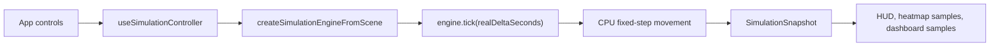
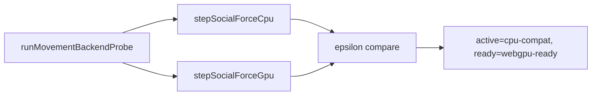
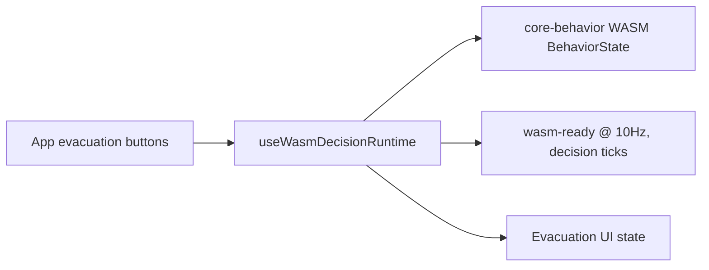

# CrowdSim runtime kernel baseline

This document freezes the current runtime truth for phase 2 work. It is the
contract for the next implementation steps: WebGPU movement as an optional
backend, WASM decision ticks that mutate agent behavior, worker simulation, SAB
transport, and live replay/validation.

## Current runtime profile

Source of truth: `packages/app/src/simulationEngine.ts`.

- Movement backend: `cpu-compat`
- Movement cadence: 60 Hz fixed step (`fixedDtSeconds = 1 / 60`)
- Decision backend exposed by the static profile: `rule-ts`
- Decision cadence: 10 Hz
- Browser simulation cap: 2,000 agents
- Render benchmark cap: 100,000 visual agents, separate from live simulation

The product UI now exposes the distinction between live simulation and visual
render benchmark. The runtime still needs a dynamic profile once phase 2 turns
WebGPU/WASM/worker paths into selectable active backends.

## Main-thread simulation flow

Current app flow:

Evidence:

- `packages/app/src/useSimulationController.ts` keeps `engine` in React state and
  advances it on `requestAnimationFrame`, with a 30 Hz watchdog.
- `packages/app/src/simulationEngine.ts` owns agent spawning, target selection,
  wall constraints, flow-field sampling, and position/velocity updates.
- `SimulationSnapshot` is copied out of the engine on every update.

Limitations:

- The engine owns mutable agent arrays internally, not a shared SoA transport.
- Movement writes are CPU-only.
- The controller runs on the main thread.
- Dashboard and heatmap samples are sampled from snapshots at 1 Hz, not from a
  continuous recording channel.

## CPU movement contract

Current CPU movement step:

1. Sample arrivals from each source with seeded Poisson sampling.
2. Spawn up to `maxAgents`.
3. For each agent, choose the nearest sink on spawn.
4. Sample a precomputed CPU flow field when available.
5. Move toward target with a fixed speed.
6. Resolve walls/world bounds with `constrainMovement`.
7. Remove agents that enter sink radius.

Evidence:

- `createSimulationEngine` in `packages/app/src/simulationEngine.ts`
- `wallSegmentsFromScene`, `constrainMovement`, and `clampPointToWorld` in
  `packages/app/src/sceneGeometry.ts`
- flow-field helpers from `@crowdsim/core-gpu`

This is deterministic for a fixed seed and fixed-step sequence. Phase 2 WebGPU
movement must preserve this determinism for small alignment fixtures before it
can become an active backend.

## WebGPU movement boundary

Current WebGPU movement state:

Evidence:

- `packages/app/src/movementBackendProbe.ts`
- `packages/core-gpu/src/motionGpu.ts`
- `packages/core-gpu/src/socialForceCpu.ts`

The WebGPU path currently proves readback correctness for a 4-agent social-force
fixture. It does not own the app's live agent positions and does not update
`SimulationSnapshot`.

Required phase 2 transition:

- Extract a movement backend interface that can accept a live agent set, targets,
  walls, and fixed `dt`.
- Implement a CPU backend first as a compatibility wrapper around current logic.
- Add a WebGPU backend that can run the same fixture and report fallback reasons.
- Only after CPU/GPU alignment tests pass should the app allow GPU as an active
  movement backend.

## WASM decision boundary

Current WASM decision state:

Evidence:

- `packages/app/src/wasmDecisionRuntime.ts`
- `packages/app/src/behaviorWasm.ts`
- `packages/core-behavior/src/*`

WASM is now in the control flow for evacuation mode and reset, and it exposes a
decision tick count derived from `SimulationSnapshot.stepCount`.

Limitations:

- Decision ticks do not mutate per-agent behavior/state.
- Shop choice, queue choice, and DES scheduling are still probe/panel paths.
- Agent targets remain sink-oriented and are not assigned by WASM behavior.

Required phase 2 transition:

- Define an agent decision state payload that can round-trip between the engine
  and WASM.
- On each 10 Hz decision tick, update at least evacuation/browse/queue state.
- Feed WASM decisions back into `targetX`, `targetY`, and dashboard metrics.

## Worker and SAB boundary

Current worker state:

- `packages/app/src/experimentWorkerClient.ts` runs experiment queues in a worker.
- `packages/app/src/experiment.worker.ts` handles headless experiment requests.
- The live simulation controller does not use a worker.

Current SAB state:

- `packages/app/src/sharedArrayBufferProbe.ts` checks `SharedArrayBuffer`,
  `Atomics`, and `crossOriginIsolated`.
- Vite dev/preview sets COOP/COEP headers in `packages/app/vite.config.ts`.
- No live simulation data travels through SAB yet.

Required phase 2 transition:

1. Move live simulation tick into a worker with structured-clone snapshots.
2. Keep start/pause/reset/timeScale controls equivalent.
3. Add SAB only after the worker fallback path is stable.
4. Represent agent state as SoA buffers for positions, velocities, targets, and
   behavior states.

## Replay and validation boundary

Current replay state:

- `packages/app/src/trajectoryRecording.ts` can append frames from
  `SimulationSnapshot`, interpolate replay, pack, unpack, and estimate size.
- `TrajectoryReplayPanel` still demonstrates the mechanism with synthetic sample
  snapshots.
- App heatmap/dashboard sampling is live, but trajectory recording is not yet
  wired to the live controller.

Current benchmark state:

- `packages/app/src/benchmarkRunner.ts` runs scenarios through
  `createSimulationEngineFromScene`.
- Reproducibility hash covers scenario id, step count, and metrics.
- The runner has no runtime backend selector yet.

Required phase 2 transition:

- Record live snapshots behind a bounded recording window.
- Expose replay/export from the live run, not a synthetic panel fixture.
- Extend benchmark options with runtime backend metadata.
- Include runtime profile in validation reports and reproducibility artifacts.

## Phase 2 dependency order

1. Movement backend interface with CPU compatibility behavior.
2. WebGPU movement backend active only behind readiness/alignment gates.
3. WASM decision tick mutating agent behavior and targets.
4. Worker controller using structured clone snapshots.
5. SAB SoA transport as an optimization and synchronization contract.
6. Live trajectory recording and replay/export.
7. Benchmark/validation runtime profile binding.

## Non-goals for phase 2 core work

- Full visual redesign.
- Raising live agent counts by hiding the current engine limit.
- Treating render benchmark agents as simulated behavior agents.
- Treating current validation fixtures as formal evacuation certification.
