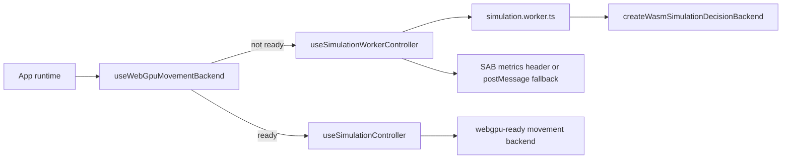

# CrowdSim runtime kernel baseline

This document tracks the current phase 2 runtime truth after the kernel
convergence work. It is intentionally about implementation evidence, not product
marketing.

## Current runtime profile

Source of truth:

- `packages/app/src/simulationEngine.ts`
- `packages/app/src/useSimulationController.ts`
- `packages/app/src/useSimulationWorkerController.ts`
- `packages/app/src/simulationRuntimeArtifact.ts`

Current profile:

- Movement cadence: 60 Hz fixed step.
- Decision cadence: 10 Hz.
- Live simulation cap: 2,000 agents.
- Render benchmark cap: 100,000 visual agents, separate from live simulation.
- Default live thread: worker controller with structured-clone snapshots.
- Default live decision runtime: worker-created WASM decision backend.
- Shared memory: optional SAB metrics header when cross-origin isolation allows
  it; otherwise postMessage snapshots remain authoritative.
- WebGPU movement: optional active backend when CPU/WebGPU alignment passes.

## Runtime selection

Evidence:

- `packages/app/src/App.tsx` chooses the worker controller unless WebGPU movement
  is active, in which case it preserves the main-thread GPU device path.
- `packages/app/src/useWebGpuMovementBackend.ts` creates a persistent GPUDevice,
  verifies CPU/GPU movement alignment, and exposes an active movement backend.
- `packages/app/src/useSimulationWorkerController.ts` initializes the live worker
  with `runtime: { wasmDecisionBackend: true }` and publishes SAB metrics when
  available.

## Movement backend

The movement backend contract lives in `packages/app/src/movementBackend.ts`.

Implemented paths:

- `cpu-compat`: active CPU compatibility backend.
- `webgpu-ready`: WebGPU social-force backend. It is first used in ready mode for
  alignment, then active mode when injected into the app runtime.

Live app behavior:

- If WebGPU movement alignment succeeds, App injects the WebGPU backend into
  `useSimulationController`.
- If WebGPU is unsupported or alignment fails, App uses the worker controller and
  CPU movement fallback.

Verification:

- `packages/app/src/movementBackend.test.ts`
- `packages/app/src/movementBackendProbe.test.ts`
- `packages/app/src/useWebGpuMovementBackend.test.tsx`
- `packages/app/src/simulationEngine.test.ts`

## WASM decision backend

The decision backend contract lives in
`packages/app/src/simulationDecisionBackend.ts`.

Implemented behavior:

- Decision ticks run at 10 Hz against the 60 Hz movement clock.
- WASM `ShopDecisionModel` can select live shop targets.
- Decisions write `lifecycleState`, `selectedStoreId`, `targetX`, and `targetY`
  back onto live `SimulationAgent` snapshots.
- The worker creates its own WASM decision backend during `init`, avoiding
  structured-clone of functions or class instances.

Verification:

- `packages/app/src/simulationEngine.test.ts`
- `packages/app/src/useSimulationController.test.tsx`
- `packages/app/src/useWasmSimulationDecisionBackend.test.tsx`
- `packages/app/src/useSimulationWorkerController.test.tsx`

## Worker and SAB transport

Live worker files:

- `packages/app/src/simulation.worker.ts`
- `packages/app/src/simulationWorkerClient.ts`
- `packages/app/src/useSimulationWorkerController.ts`

Implemented behavior:

- Worker protocol supports `init`, `start`, `pause`, `reset`, `set-time-scale`,
  `tick`, and `snapshot`.
- Worker fallback is an inline client when `Worker` is unavailable.
- SAB is used for a metrics header, not for full agent SoA transport yet.
- The SAB header currently stores status, step count, agent count, spawned count,
  exited count, and elapsed milliseconds.

Verification:

- `packages/app/src/simulationWorkerClient.test.ts`
- `packages/app/src/useSimulationWorkerController.test.tsx`
- `packages/app/src/sharedArrayBufferProbe.test.ts`

Remaining transport limitation:

- Full agent SoA transport is still not backed by SAB. Agent snapshots are still
  copied through structured clone for UI rendering.

## Replay, benchmark, and validation binding

Runtime artifact:

- `packages/app/src/simulationRuntimeArtifact.ts`

Implemented behavior:

- Benchmark results include a runtime profile and include that profile in the
  reproducibility hash.
- Packed trajectory recording preserves the runtime profile.
- The App now records live trajectory frames from the current
  `SimulationSnapshot` stream instead of using synthetic replay panel fixtures.
- The credibility report includes runtime profile evidence alongside constraints,
  metrics, and replay export readiness.

Verification:

- `packages/app/src/benchmarkRunner.test.ts`
- `packages/app/src/trajectoryRecording.test.ts`
- `packages/app/src/TrajectoryReplayPanel.test.tsx`
- `packages/app/src/simulationCredibility.test.ts`

## Known remaining gaps before final UI redesign

- Full SAB agent SoA transport is still a future optimization; only runtime
  metrics are shared through SAB today.
- WebGPU movement is active only when the readiness hook succeeds. Worker runtime
  intentionally keeps CPU movement because GPUDevice cannot be structured-cloned
  into the current worker path.
- The current UI exposes necessary runtime status, but the final productized UI
  redesign is intentionally deferred until the kernel paths are stable.
