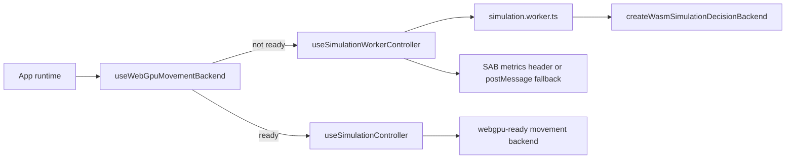

# CrowdSim runtime kernel baseline

This document tracks the current phase 2 runtime truth after the kernel
convergence work. It is intentionally about implementation evidence, not product
marketing.

## Current runtime profile

Source of truth:

- `packages/app/src/simulationEngine.ts`
- `packages/app/src/useSimulationController.ts`
- `packages/app/src/useSimulationWorkerController.ts`
- `packages/app/src/simulationRuntimeArtifact.ts`

Current profile:

- Movement cadence: 60 Hz fixed step.
- Worker snapshot/UI cadence: at most 30 Hz; one publish may contain two fixed
  movement steps, so simulated time and the 60 Hz model are unchanged.
- Decision cadence: 10 Hz.
- Live simulation cap: 2,000 agents.
- Render benchmark cap: 100,000 visual agents, separate from live simulation.
- Default live thread: worker controller with structured-clone snapshots plus
  shared agent SoA lanes when available.
- Default live decision runtime: worker-created WASM decision backend.
- Shared memory: optional SAB metrics header and agent SoA lanes when
  cross-origin isolation allows it; otherwise postMessage snapshots remain
  authoritative.
- WebGPU movement: optional active backend when CPU/WebGPU alignment passes.

## Runtime selection

Evidence:

- `packages/app/src/App.tsx` chooses the worker controller unless WebGPU movement
  is active, in which case it preserves the main-thread GPU device path.
- `packages/app/src/useWebGpuMovementBackend.ts` creates a persistent GPUDevice,
  verifies CPU/GPU movement alignment, and exposes an active movement backend.
- `packages/app/src/useSimulationWorkerController.ts` initializes the live worker
  with `runtime: { wasmDecisionBackend: true }` and publishes SAB metrics plus
  shared agent SoA status when available.

## Movement backend

The movement backend contract lives in `packages/app/src/movementBackend.ts`.

Implemented paths:

- `cpu-compat`: active CPU compatibility backend.
- `webgpu-ready`: WebGPU social-force backend. It is first used in ready mode for
  alignment, then active mode when injected into the app runtime.

Live app behavior:

- If WebGPU movement alignment succeeds, App injects the WebGPU backend into
  `useSimulationController`.
- If WebGPU is unsupported or alignment fails, App uses the worker controller and
  CPU movement fallback.

Verification:

- `packages/app/src/movementBackend.test.ts`
- `packages/app/src/movementBackendProbe.test.ts`
- `packages/app/src/useWebGpuMovementBackend.test.tsx`
- `packages/app/src/simulationEngine.test.ts`

## WASM decision backend

The decision backend contract lives in
`packages/app/src/simulationDecisionBackend.ts`.

Implemented behavior:

- Decision ticks run at 10 Hz against the 60 Hz movement clock.
- WASM `ShopDecisionModel` can select live shop targets.
- Decisions write `lifecycleState`, `selectedStoreId`, `targetX`, and `targetY`
  back onto live `SimulationAgent` snapshots.
- The worker creates its own WASM decision backend during `init`, avoiding
  structured-clone of functions or class instances.

Verification:

- `packages/app/src/simulationEngine.test.ts`
- `packages/app/src/useSimulationController.test.tsx`
- `packages/app/src/useWasmSimulationDecisionBackend.test.tsx`
- `packages/app/src/useSimulationWorkerController.test.tsx`

## Worker and SAB transport

Live worker files:

- `packages/app/src/simulation.worker.ts`
- `packages/app/src/simulationWorkerClient.ts`
- `packages/app/src/useSimulationWorkerController.ts`

Implemented behavior:

- Worker protocol supports `init`, `start`, `pause`, `reset`, `set-time-scale`,
  `tick`, and `snapshot`.
- Worker fallback is an inline client when `Worker` is unavailable.
- SAB is used for a metrics header and parallel agent SoA lanes.
- The SAB header currently stores status, step count, agent count, spawned count,
  exited count, elapsed milliseconds, capacity, and protocol version.
- Agent SoA lanes currently store id, behavior state, active flags, position,
  velocity, and target coordinates for each live slot.
- `useSimulationWorkerController` reads a bounded SAB agent frame for live status
  and 2D viewport overlay consumers.
- Structured-clone snapshots remain the authoritative full React state path,
  while SAB now provides a shared-memory evidence and fast-read channel for live
  agent overlay rendering plus future renderer/kernel consumers.

Verification:

- `packages/app/src/simulationWorkerClient.test.ts`
- `packages/app/src/useSimulationWorkerController.test.tsx`
- `packages/app/src/sharedArrayBufferProbe.test.ts`

Remaining transport limitation:

- The app still publishes full `SimulationSnapshot` objects through postMessage
  for most UI state, now capped at 30 Hz to avoid cloning and React work twice
  per display frame. The 2D viewport overlay can consume SAB agent frames, but
  full React rendering has not been switched to consume only shared memory.

## Replay, benchmark, and validation binding

Runtime artifact:

- `packages/app/src/simulationRuntimeArtifact.ts`

Implemented behavior:

- Benchmark results include a runtime profile and include that profile in the
  reproducibility hash.
- Packed trajectory recording preserves the runtime profile.
- The App now records live trajectory frames from the current
  `SimulationSnapshot` stream instead of using synthetic replay panel fixtures.
- The credibility report includes runtime profile evidence alongside constraints,
  metrics, and replay export readiness.

Verification:

- `packages/app/src/benchmarkRunner.test.ts`
- `packages/app/src/trajectoryRecording.test.ts`
- `packages/app/src/TrajectoryReplayPanel.test.tsx`
- `packages/app/src/simulationCredibility.test.ts`

## Runtime constraints retained after UI redesign

- SAB agent SoA transport is implemented and consumed by the 2D live overlay, but
  the final full rendering state path still uses structured-clone snapshots.
- WebGPU movement is active only when the readiness hook succeeds. Worker runtime
  intentionally keeps CPU movement because GPUDevice cannot be structured-cloned
  into the current worker path.
- These are non-blocking runtime constraints. They do not block the completed
  productized UI shell or the phase 2 completion gate.

## Phase 2 completion audit

Source of truth:

- `packages/app/src/simulationRuntimeConvergence.ts`
- `packages/app/src/simulationRuntimeConvergence.test.ts`

| Requirement                                                 | Evidence status | Completion | Blocks final UI |
| ----------------------------------------------------------- | --------------- | ---------: | --------------- |
| WebGPU movement optional main loop                          | Complete        |       100% | No              |
| WASM decision tick owns live agent decisions                | Complete        |       100% | No              |
| Worker simulation thread                                    | Complete        |       100% | No              |
| SharedArrayBuffer metrics and agent SoA lanes               | Complete        |       100% | No              |
| Benchmark, replay, and validation bound to runtime evidence | Complete        |       100% | No              |

Audit result:

- Kernel convergence completion: 5/5 items, 100%.
- Remaining limitations are non-blocking runtime constraints, not missing phase 2
  kernel work.
- The project has completed the deferred final productized UI redesign while
  preserving the verified worker/WASM/SAB/WebGPU runtime paths.

## Final UI productization audit

Source of truth:

- `packages/app/src/uiProductizationAudit.ts`
- `packages/app/src/uiProductizationAudit.test.ts`

| UI area           | Evidence status | Completion | Blocks completion |
| ----------------- | --------------- | ---------: | ----------------- |
| Home              | Complete        |       100% | No                |
| Command bar       | Complete        |       100% | No                |
| Sidebar controls  | Complete        |       100% | No                |
| Stage telemetry   | Complete        |       100% | No                |
| Inspector         | Complete        |       100% | No                |
| Mobile responsive | Complete        |       100% | No                |

Audit result:

- Final productized UI completion: 6/6 areas, 100%.
- Browser checks cover desktop and 390px mobile overflow for command status,
  stage telemetry, Inspector sections, and Sidebar controls.
- The UI redesign preserves the verified phase 2 worker/WASM/SAB/WebGPU runtime
  paths and does not introduce a phase 2 blocker.
